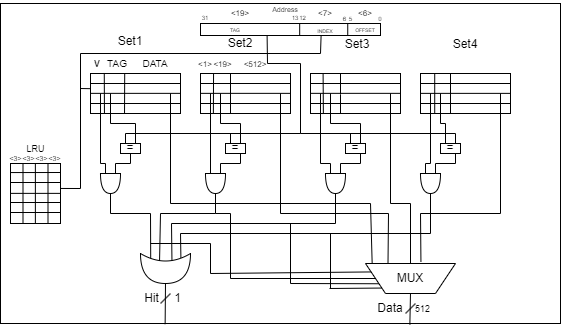
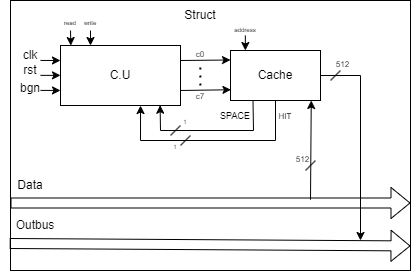
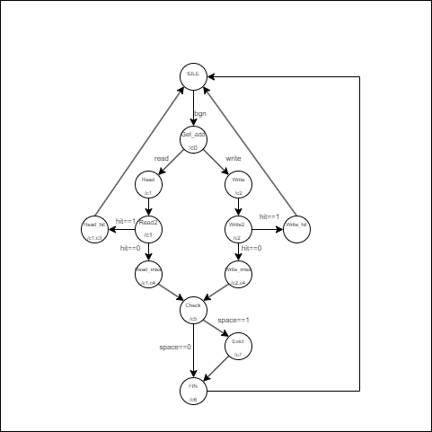

# 4-way_set-associative_cache

A simple project where is implemented a 4-way set-associative cache.

## `Table of Contents`

- [Introduction](#introduction)

## `Introduction`

The project simulates a simplified 4-way set-associative cache without main memory. 
It uses the address to write or read data from the cache.

# Architecture for the cache

# Structure

# FSM

